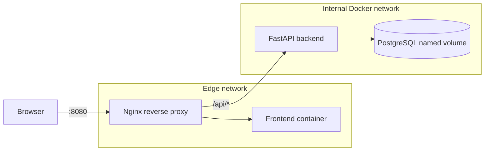

# Three-Tier Task Manager

A compact task manager built primarily to demonstrate practical Docker and DevOps skills.
The application has a static frontend, a FastAPI API, PostgreSQL persistence, and an Nginx
edge proxy. It includes migrations, health checks, structured logs, tests, scanning, backups,
and separate development and production Compose behavior.

## Architecture



Only Nginx publishes a host port. The API and database communicate over an `internal: true`
network, and PostgreSQL has no host port.

## Technology stack

- Python 3.12.13, FastAPI 0.115.12, SQLAlchemy 2.0.40, Alembic 1.15.2
- PostgreSQL 17.4 Alpine
- Node.js 22.14 Alpine build stage and dependency-free browser JavaScript
- Nginx Unprivileged 1.27.4 Alpine
- Docker Compose, pytest, Ruff, Node test runner, Hadolint, and Trivy
- GitHub Actions on Ubuntu 24.04

Important Python, Node, PostgreSQL, Nginx, Hadolint, and Trivy versions are pinned.

## Prerequisites

- Linux, or Windows 11 with WSL2
- Docker Engine with Compose v2, or Docker Desktop with WSL2 integration
- GNU Make, Python 3.12, Node.js 22, and npm for host-side checks
- Approximately 2 GB of free memory and 3 GB of disk space

No cloud account or paid resource is required.

## Installation and development

```bash
cp .env.example .env
# Replace every change-me value in .env.
make setup
make up
```

Open <http://localhost:8080>. Development uses `compose.dev.yml`: frontend and backend source
directories are mounted read-only, FastAPI reload is enabled, log level is DEBUG, and restart
policies are disabled for easier debugging.

Stop the stack without deleting data:

```bash
make down
```

## Production-style configuration

Create a protected `.env` with a generated database password, then run:

```bash
docker compose -f compose.yml -f compose.prod.yml config
make prod
```

The production override uses immutable production stages, read-only filesystems, tmpfs for
writable runtime paths, dropped Linux capabilities, `no-new-privileges`, bounded resources,
and restart policies. It does not provide TLS, orchestration, or secret management and is a
single-host demonstration rather than a complete internet-facing deployment.

## Migrations

The backend entrypoint waits for PostgreSQL, runs `alembic upgrade head`, and then uses `exec`
to start Uvicorn so termination signals reach the server. Manual commands:

```bash
make migrate
docker compose exec backend alembic current
```

Create schema changes with `alembic revision --autogenerate`, review the generated SQL, and
test both upgrade and downgrade paths.

## Verification

```bash
make lint
make test
docker compose ps
curl --fail http://localhost:8080/health
curl --fail http://localhost:8080/api/v1/tasks
docker compose logs --tail=50 backend
```

The second `curl` proves proxy-to-backend routing and database readiness. Backend logs are
newline-delimited JSON with request IDs, status codes, duration, and lifecycle events.

## Backup and restore

```bash
make backup
make restore FILE=backups/tasks-YYYYMMDDTHHMMSSZ.sql.gz
```

Backups receive mode `0600` and are gitignored. Restore requires typing `RESTORE`. Test restores
regularly; an untested backup is only an assumption.

## Troubleshooting

- **Compose rejects variables:** copy `.env.example` to `.env` and replace all required values.
- **Proxy reports 502/503:** inspect `docker compose ps` and backend/database health logs.
- **Database volume permission error:** recreate only a disposable development volume with
  `make clean`; never delete a production volume without a verified backup.
- **Port 8080 is busy:** change `APP_PORT` in `.env`.
- **Migration fails:** inspect `docker compose logs db backend` and run `alembic current`.
- **Docker Desktop cannot mount WSL files:** keep the repository inside the WSL filesystem or
  enable file sharing for the Windows path.

## Security considerations

- Application, proxy, frontend, and database processes use explicit non-root UIDs.
- Only the proxy publishes a port; the API and database network is internal.
- Production containers drop capabilities and use read-only filesystems where practical.
- Nginx applies request limits and basic browser security headers.
- Required environment variables fail Compose interpolation when absent, and Pydantic validates
  application settings on startup.
- Secrets and dumps are ignored, but Compose environment variables are not a secret manager.
- The application intentionally has no user authentication or authorization.

## Limitations

- Single-host Compose provides no high availability, rolling updates, or automatic failover.
- No TLS, authentication, authorization, pagination, monitoring backend, or centralized logs.
- The UI is deliberately dependency-free and has no framework-level component testing.
- Compose `deploy.resources` support varies outside Docker Compose and Swarm implementations.
- PostgreSQL backups are logical full dumps without retention scheduling or encryption.

## Future improvements

- Add OpenTelemetry metrics/traces and dashboards.
- Add authentication, per-user task ownership, pagination, and audit events.
- Add TLS via a local CA or managed ingress in a staging environment.
- Sign images, generate SBOMs, pin images by digest, and publish provenance attestations.
- Add scheduled encrypted backups with automated restore drills.
- Add Kubernetes manifests only after the Compose operational model is well understood.

## Interview talking points

- Logical three-tier architecture versus four runtime containers.
- Multi-stage builds reduce runtime tooling and attack surface.
- Nginx is the only ingress point; PostgreSQL is not host-accessible.
- Health checks gate dependencies but do not replace observability.
- `exec` and Uvicorn grace periods provide predictable shutdown.
- Migrations and restore tests make state changes operationally reviewable.
- Development optimizes feedback; production optimizes immutability and least privilege.

See `INTERVIEW.md` and `DEMO.md` for a prepared walkthrough.

## License

MIT. See `LICENSE`.
